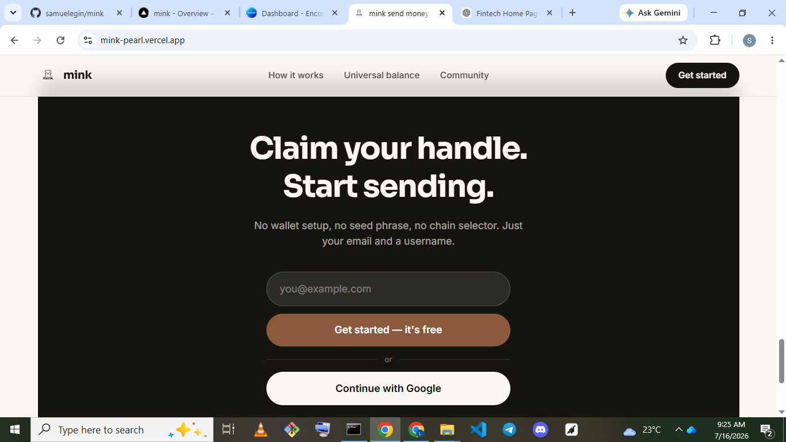
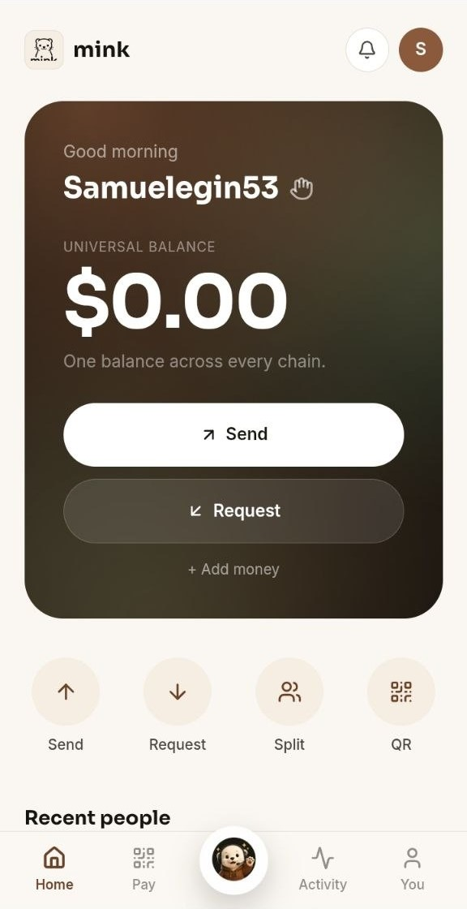
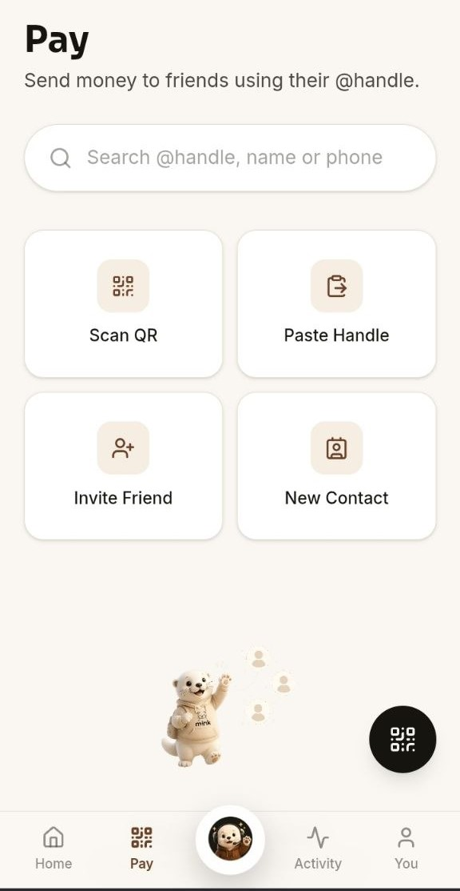
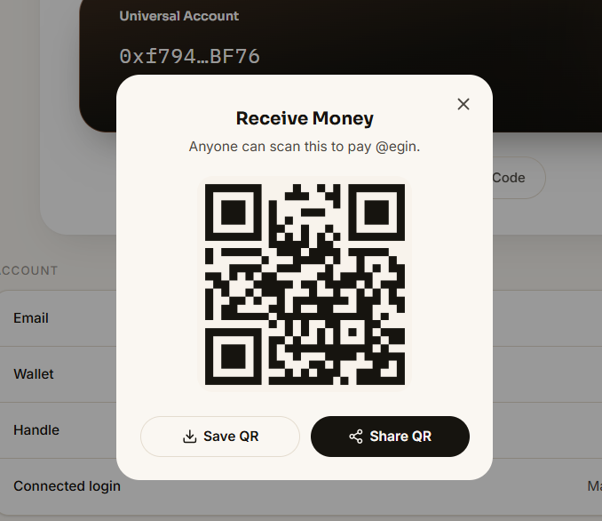
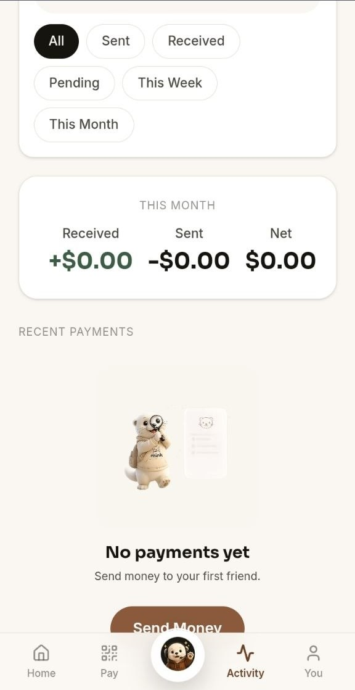

# mink

**Send money like a message.**
A chain-abstracted social payments app — powered by Universal Accounts.

**UXmaxx Hackathon 2026 — Samuel Egin · Gabriel Michael Ojomakpene**

---

## The Problem

Crypto payments still feel like crypto. Sending a friend $5 shouldn't require:

- **Copying wallet addresses** — `0x73F8...9aD2` instead of a name
- **Bridging between chains** — a separate app, a separate wait, before the payment even starts
- **Managing gas tokens** — holding a second asset just to move the one you actually want to send
- **Explaining blockchain before sending $5** — the onboarding cost kills casual, Venmo-style usage before it starts

## Our Solution

mink removes blockchain from the payment experience entirely.

- **No addresses** — send directly to `@alex`, not a 42-character string
- **No bridges** — assets move across chains automatically, behind the scenes
- **No chain selection** — no MetaMask, no network switcher; money simply arrives

## Why Universal Accounts

Instead of asking users **"What chain are you on?"** — network selection, bridging, gas management, all friction that stops adoption — mink asks one question: **"Who do you want to pay?"**

Chain abstraction handles everything else. The result is invisible infrastructure: all the power of blockchain, none of the complexity. Payments just work.

## How It Works

```
01  Log in with email or Google              Magic creates an embedded wallet, no seed phrase
02  Search a friend by @handle                Handle resolves to their wallet address
03  Enter an amount and hit Send              UA previews the transfer + fee across all chains
04  Sign once (twice on a chain's first tx)   EIP-7702 auth (if needed) + the transfer itself
05  UA auto-sources value from any chain      Settles as native USDC on Arbitrum for the recipient
06  Receipt logged on-chain                    PaymentRegistry.logPayment() — public, verifiable
```

The experience feels like sending a message, not executing a blockchain transaction.

## Why It's Different

Traditional wallets focus on transactions. mink focuses on people — sending money to someone you know, not an address you copied. That's the shape we're building the Activity feed and receipts around: `@sam paid @jane $12 ☕`, not a hash.

## Overview

A user logs in with email — no seed phrase, no wallet extension — and Magic instantly gives them an embedded EOA wallet. That same EOA is upgraded in place into a Particle **Universal Account** via **EIP-7702**: no new address, no asset migration, no smart-account deployment. The user's balance across every supported chain becomes one spendable balance.

When they pay a friend by `@handle`, mink auto-sources the value from wherever the sender actually holds funds and settles it as native USDC on **Arbitrum One** for the recipient — invisibly. Every settled payment also gets a public, permissionless on-chain receipt via `PaymentRegistry.sol`, verifiable by anyone independent of mink's own backend.

## Repo Structure

mink is **not** a monorepo — two independently-installed projects living in one repo:

```
mink/
├── src/                     React + Vite + Tailwind frontend
│   ├── components/          Screens: Home, Pay, Activity, You, onboarding
│   ├── lib/                 magic.ts, universalAccount.ts, universalPaymentClient.ts, contracts.ts
│   └── context/              Auth + Toast providers
├── contracts/                Independent Hardhat project (@mink contracts)
│   ├── contracts/           PaymentRegistry.sol
│   ├── test/                 Hardhat/Chai test suite
│   └── scripts/deploy.ts
├── package.json               Frontend (npm)
└── contracts/package.json     Contracts (npm, separate install)
```

Install each independently: `npm install` at the root for the frontend, `cd contracts && npm install` for the contracts project. There's no shared workspace tooling — the two are deployed and versioned separately on purpose, since the frontend targets a live app and the contract targets a testnet.

Handle claiming and resolution (`@handle` → wallet address) is backend-managed, not an on-chain registry — an earlier on-chain `HandleRegistry` contract was deprecated in favor of this in a later revision.

## Architecture

```
User
  ↓
Magic Embedded Wallet
  ↓
Particle Universal Account (EIP-7702)
  ↓
Universal Balance
  ↓
Payment Execution  →  settles as USDC on Arbitrum One
  ↓
PaymentRegistry.sol  →  public on-chain receipt (Arbitrum Sepolia)
```

| Contract | Role |
|---|---|
| `PaymentRegistry` | Permissionless on-chain payment receipt log — records sender, recipient, amount, and note per payment; maintains running sent/received totals per address; never custodies funds, called only after a payment has already settled via UA |

`PaymentRegistry` runs on Arbitrum **Sepolia** deliberately, decoupled from the real mainnet settlement chain — the receipt is supplementary proof, not the payment itself, so it costs free testnet gas instead of real mainnet gas on every send.

## Live Deployment

| Component | Location |
|---|---|
| Frontend | [mink-pearl.vercel.app](https://mink-pearl.vercel.app) |
| Settlement chain (UA) | Arbitrum One (mainnet) — native USDC |
| `PaymentRegistry` | Arbitrum Sepolia (testnet) — [`0x4ebf10a9d811Db922acF9310E1c6bEA27630e7E9`](https://sepolia.arbiscan.io/address/0x4ebf10a9d811Db922acF9310E1c6bEA27630e7E9) |

## Progress

**Completed**
- Magic embedded wallet login (email + Google), zero seed phrase
- Particle Universal Account integration in EIP-7702 mode — one balance, any supported chain
- Cross-chain send flow: sender funds sourced from wherever they sit, recipient always settles in USDC on Arbitrum
- `PaymentRegistry.sol` deployed to Arbitrum Sepolia, wired end-to-end into the send flow
- Home and You screens redesigned for a compact, premium fintech feel — official chain logos, simplified profile header, condensed Universal Account card

**Next**
- Social Activity feed polish (`@sam paid @jane` style, not transaction hashes)
- Demo recording with real mainnet funds
- Broader chain/asset coverage as Particle expands Primary Asset support

## Hackathon Tracks

Built for:
- **Universal Accounts Track** (Particle Network) — EIP-7702 mode, cross-chain value movement via UA, functional demo
- **Arbitrum "Road to Open House London" Bounty** — Arbitrum as the invisible settlement/backend layer, chain-abstracted consumer UX
- **Magic Labs Bonus Challenge** — Magic embedded wallet for walletless onboarding

## Running Locally

**Prerequisites**
- Node.js v18+
- A Magic publishable key ([dashboard.magic.link](https://dashboard.magic.link))
- Particle Project ID / Client Key / App ID ([dashboard.particle.network](https://dashboard.particle.network))

**Environment variables** — create `.env` at the repo root:

```
VITE_MAGIC_PUBLISHABLE_KEY=
VITE_PARTICLE_PROJECT_ID=
VITE_PARTICLE_CLIENT_KEY=
VITE_PARTICLE_APP_ID=
VITE_PAYMENT_REGISTRY_ADDRESS=
```

**Install and run the frontend**

```
npm install
npm run dev
```

**Contracts — install, test, and deploy separately**

```
cd contracts
npm install
npm run compile
npm run test
npm run deploy:arbSepolia
```

Copy the deployed address into `VITE_PAYMENT_REGISTRY_ADDRESS` above.

## Tech Stack

| Layer | Stack |
|---|---|
| Frontend | React · Vite · TypeScript · Tailwind CSS |
| Auth / Wallet | Magic SDK · `@magic-ext/oauth2` (Google OAuth) |
| Chain Abstraction | Particle Universal Account SDK — EIP-7702 mode |
| Blockchain Lib | ethers v6 |
| Smart Contracts | Solidity 0.8.24 · Hardhat · Chai/Mocha |
| Settlement | Arbitrum One (USDC) |

## Screenshots

| | |
|---|---|
| **Landing** — email-only signup, first thing you see | **Home** — one unified balance across every chain |
|  |  |
| **Pay** — send by @handle, scan a QR, or paste an address | **Receive** — shareable QR tied to your @handle |
|  |  |
| **Activity** — sent, received, and pending, at a glance | |
|  | |

## Vision

Crypto as communication. Every payment a message, not a transaction — sent to a person, arriving wherever they actually are.

## Team

**Samuel Egin** — Blockchain Dev · [@0xEtherfren](https://twitter.com/0xEtherfren)
**Gabriel Michael Ojomakpene** — Frontend Dev

*UXmaxx Hackathon 2026*
